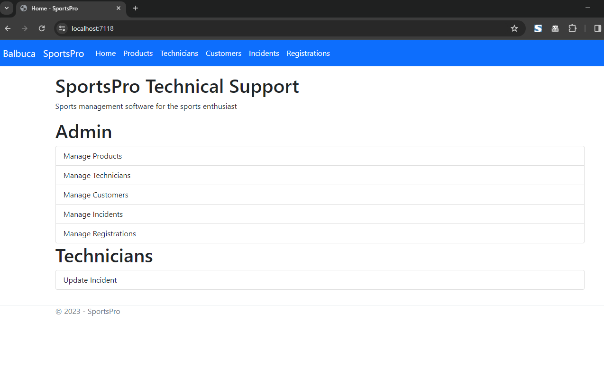
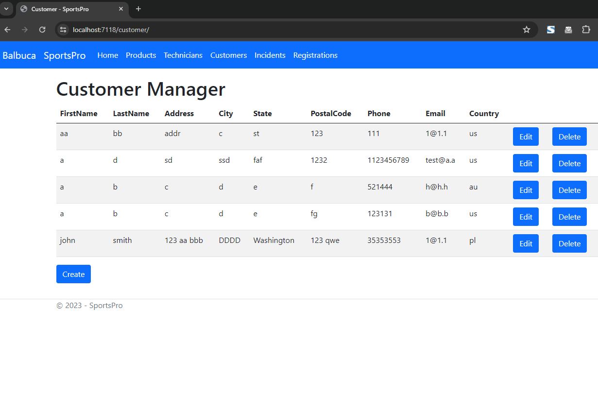
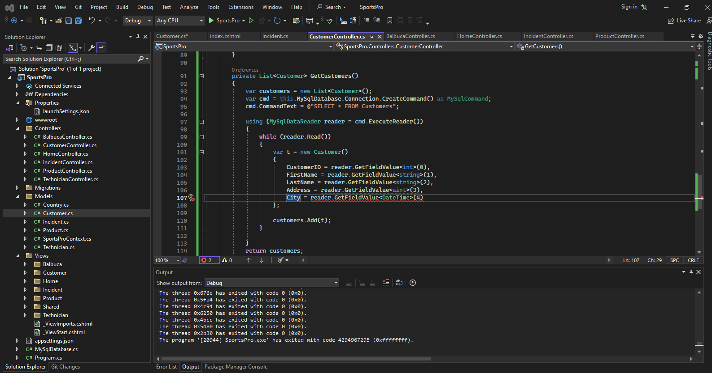

# ASP_SportsPro
C#  .NET ASP MVC Javascript  MySQL

## install NuGet Packages to connect with MySQL
Microsoft.EntityFrameworkCore.Design   \
Microsoft.EntityFrameworkCore.Tools    \
MySql.EntityFrameworkCore              
## Running screens

